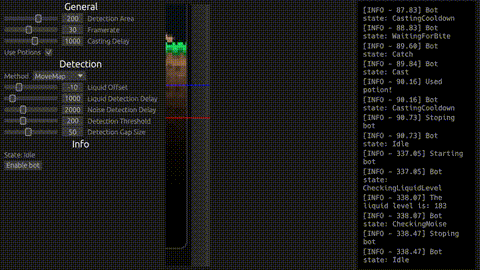
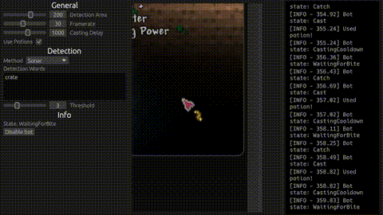

# Terraria Fishing Bot

Terraria advanced fishing bot, written entirely in Rust. Created for practicing/learning Rust.

## Features

- [x] Reliable fishing in water/lava/honey
- [ ] Reliable fishing with noise like enemies
- [x] Gui
- [x] Automatic potion use
- [ ] Fast unload to nearbay chests
- [ ] Handle events (Bloodmon, Invesions)
- [x] Working with sonar potion
- [x] Saving settings

## Preview

### Movemap method

### Sonar method

## Manual

1. Install zip file from releases tab in this repository.
2. Unzip it in any directory, like desktop.
3. Run .exe.
4. Setup settings in gui.
5. Setup cursor just slightly below where you want to fish.
6. Press P to start/stop and don't move both cursor and your character.

# Things to Know

- The bot `WILL NOT WORK` in movemap mode if you do not have waves enabled.
- Bot tracking area around cursor.
- The bot may not work properly in hell due to distortion. It is better to set a contrasting background.
- During heavy rain, false alarms sometimes occur. It is better to put up a roof.
